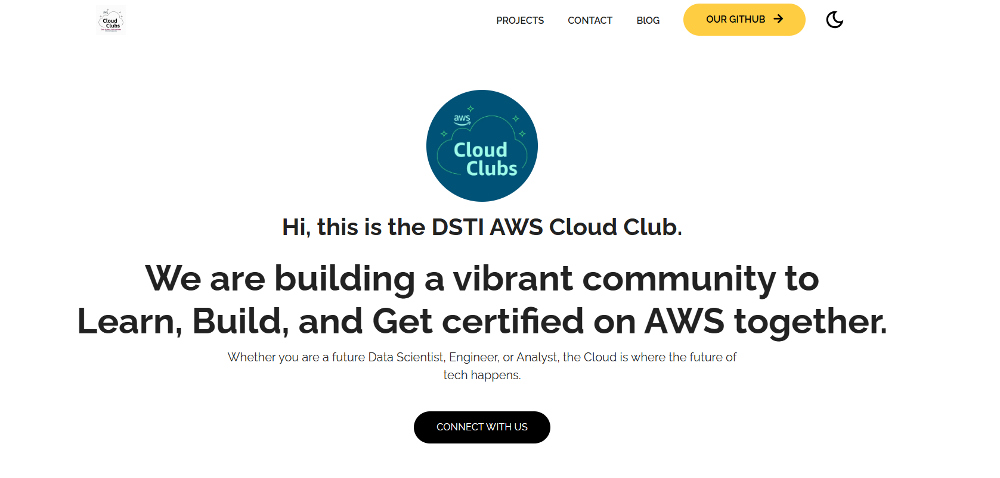

# 🚀 Workshop: Create and Deploy Your Portfolio with GitHub Pages


## 📋 Prerequisites

* A [GitHub](https://github.com/) account.
* **Git** installed on your machine.
* A text editor (recommended: [VS Code](https://code.visualstudio.com/)).

Portfolio template(_You can use one of these templates to create your portfolio_): 

  * https://github.com/topics/portfolio-template?l=css
  * https://iluskaland.github.io/portfolio-template/index.html
  * https://github.com/bedimcode/responsive-portfolio-website-patrick
  * https://github.com/roycenoel/portfolio
  * https://github.com/hhlitval/simple-portfolio-template
  * https://github.com/hhlitval/simple-portfolio-template


Portfolio model: https://cpro-portfolio-html.netlify.app/#projects


---
## 1. Get the Project (Fork)

Instead of starting from scratch, we'll copy an existing project.

1. Go to the template repository page.
2. Click the **Fork** button (top right).
3. Choose your personal account as the destination.
4. In **Repository name**, rename it to: `your-username.github.io`.


## 2. Configure Automatic Deployment

1. Go to the **Settings** tab > **Pages**.
2. Under **Build and deployment** > **Source**, choose **GitHub Actions**.
3. Click the **Configure** button for the "Static HTML" module.
4. In the editor that opens, find the line `path: '.'`
5. Replace it with: `path: './src'`.
6. Click **Commit changes...** at the top right.

---

## 4. Customize Locally

Now let's bring the code to your computer to modify it.

1. **Clone the project:**
Open a terminal and type:
```bash
git clone https://github.com/YOUR-USERNAME/your-username.github.io.git
cd your-username.github.io

```


2. **Modify the content:**
* Open the folder in VS Code.
* Go to the `src/` folder.
* Edit `index.html` (your name, your bio, your projects).
* Replace the images with your own.


3. **Test:**
Open the `src/index.html` file in your browser to see the result.

---

## 5. Update the Website Online

Once you're satisfied with your changes, push them to GitHub:

1. **Add the changes:**
```bash
git add .

```


2. **Commit the changes:**
```bash
git commit -m "Update my portfolio"

```


3. **Push to GitHub:**
```bash
git push origin main

```


> 💡 **Did you know?** As soon as you do a `push`, GitHub automatically restarts the "GitHub Action". Your site will be updated online in less than a minute!

---

## 🔗 Your Site is Ready!

Your portfolio is now visible at:

`https://your-username.github.io/`

---

### 🛠️ Troubleshooting (Tips for the workshop)

* **Broken images?** Check that the path in the HTML is correct (e.g., `images/photo.jpg` and not `/src/images/photo.jpg`).
* **404 Error?** Wait 2 minutes for the first Action to complete (check the **Actions** tab on GitHub).


<a href="/"></a>

